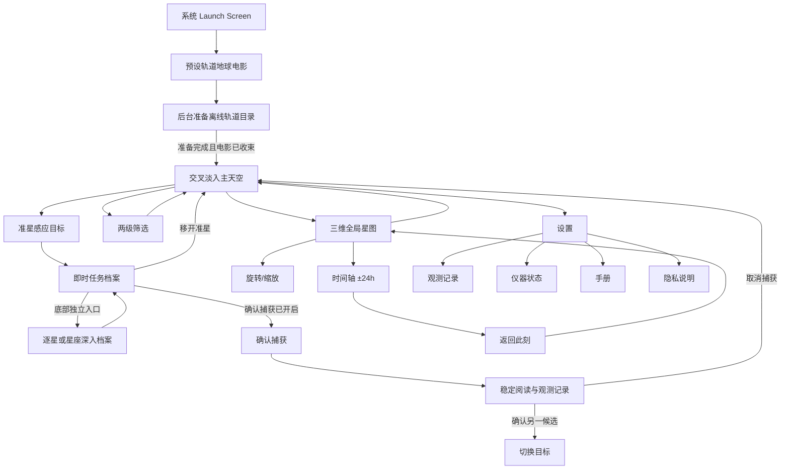

# StarCatch 项目全景说明

> 文档版本：2026-08-21
> 对应应用版本：1.0（Build 1）
> 文档依据：当前 Swift 源码、随包轨道目录、工程配置、测试与发布清单

## 1. 项目摘要

StarCatch 是一款面向 iPhone 的人造天体观察应用。用户举起手机后，应用根据设备姿态、真北方向、观察者坐标和本地轨道数据，计算此刻位于手机指向区域内的人造天体，并以克制的深空仪器界面呈现卫星、空间站、望远镜、退役航天器和轨道残留。

它并不是通过摄像头识别画面中的亮点，也不是把普通星图贴在屏幕上。当前实现的核心链路是：

1. CoreMotion 提供手机背面视轴在真实世界中的方向。
2. CoreLocation 提供观察者坐标，并协助建立真北参考系。
3. 随 App 打包的 CelesTrak GP/OMM 快照提供轨道元素。
4. SatelliteKit 在设备本地执行 SGP4 传播。
5. 投影系统把方位角、仰角和三维轨道位置映射到主天空或全局星图。
6. 捕获状态机决定目标何时被感应、确认、切换和释放。
7. 档案、轨迹、筛选、观测记录和时间轴围绕同一份轨道事实工作。

当前工程已经具备一套完整 iOS 应用所需的主要页面、导航、返回逻辑、设备权限降级、设置、帮助、隐私说明、错误状态和本地记录。它可以作为 1.0 功能候选版本继续进行真机精度验证与 App Store 提交流程。

## 2. 当前工程规模

以下数字来自 2026-08-21 的本地工作区盘点。

| 指标 | 当前规模 |
| --- | ---: |
| 随包轨道对象 | 16,395 个 |
| 人工重点校订档案 | 19 篇 |
| 应用 Swift 源文件 | 44 个 |
| Swift 测试文件 | 2 个 |
| Swift 代码与测试总行数 | 约 18,037 行 |
| 单元测试方法 | 94 个 |
| `StarCatch` 源码与资源目录 | 约 33 MB |
| `catalog.json` | 约 14.4 MiB |
| `satellite_profiles.json` | 约 16.4 MiB |
| 当前工作区 | 约 88 MB，不含 `.git` 与 DerivedData |
| 最低系统版本 | iOS 17.0 |
| 设备方向 | iPhone、竖屏、全屏 |
| 应用版本 | 1.0（Build 1） |

项目只有一个运行时第三方 Swift Package：SatelliteKit。工程精确锁定 2.1.2，
用于本地 SGP4 轨道传播；升级前必须通过 Vallado 近地与深空标准向量回归测试。

## 3. 已完成的用户功能

### 3.1 启动与首次使用

应用已经实现完整的首次进入流程：

- Launch Screen 使用与应用一致的深黑背景，避免系统白屏闪烁。
- SwiftUI 第一帧立即建立与主天空连续的固定星场和预设轨道地球；16,395 条真实目录继续在后台准备，
  不阻塞窗口建立。
- 首次与回访使用同一段约 3.2 秒的纯享地球电影：4,600 个确定性解析轨道目标中最多 24 个带
  短拖尾，地球与卫星逐步加速；画面只保留底部低透明度 `STARCATCH`。
- 启动地球使用与全局仪表一致的编译期大陆轮廓，以暗色分离底线和冷白/灰绿受光细线呈现；
  全局地球在交互时始终保留该基础轮廓，静止后再替换为资源中的高精度海岸线。
- 启动场景不读取目录、真实星表、位置或海岸线资源，不执行 SGP4、网络、模糊或 Shader；它不
  显示返回、时间轴、当前位置、加载模块、状态文字或按钮。
- 真实准备在 3.2 秒内完成时等待电影收束后交叉淡入主天空；准备较慢时连续降速到稳定巡航，
  完成后立即进入，不重新黑场或重置轨道相位。
- 首次启动不再插入额外介绍页；主天空直接接管，五页观测手册仍可从设置中按需打开。
- 手册可以从设置中重新打开。
- Reduce Motion 开启时显示无旋转、无拖尾的静态地球，准备完成后快速淡入天空。

五页手册当前包含：

1. 这台仪器：说明应用帮助用户感知肉眼不可见的人造天体。
2. 如何观察：说明准星、边缘方向提示、即时档案和可选确认捕获。
3. 时间坐标：说明全局星图与时间轴的关系。
4. 数据与坐标：说明 SGP4、CelesTrak、数据龄期、位置和姿态用途。
5. 观测就绪：说明设置、手册与隐私入口。

### 3.2 主天空与设备指向

主页面是实时捕捉视野，已经实现：

- 真机使用 CoreMotion 以 60 Hz 获取设备姿态。
- 视轴采用手机背面法线，符合“举起手机向外观察”的直觉。
- 获得定位权限并满足系统条件时使用真北参考系。
- 磁场校准质量不足时不会把方向伪装成可靠真北，而是标记为未校准。
- 四元数使用 slerp 低通，降低手部细小抖动造成的点位跳变。
- 正对天顶时使用真北投影作为备用参考，避免计算产生 NaN 或整片天空消失。
- 模拟器自动切换为手动指向源，可通过拖拽改变方位和仰角。
- 应用进入后台时停止姿态和轨道定时任务，回到前台后恢复。

主天空以 30 fps 的 `TimelineView + Canvas` 绘制。点位在真实传播帧之间进行插值，因此卫星会连续移动，而不是每次轨道刷新时跳切。

### 3.3 相机式局部放大

主天空支持双指捏合：

- 基础竖向视场为 55°。
- 最大放大倍率为 4×。
- 放大围绕固定的中央准星进行，手机姿态仍然决定镜头朝向。
- 放大后会出现“恢复视野”胶囊控件。
- 复位使用统一镜头动画，不改变当前指向或捕获状态。
- 全局星图出现时，主天空手势停止接收缩放，避免父子视图同时响应。

### 3.4 卫星感应、捕获、切换与释放

捕获系统已经被拆成即时识别和持续捕获两种模式。

默认情况下，“确认捕获”关闭：

- 主页面不显示底部捕获按钮。
- 准星进入目标附近后，目标信息随视线出现。
- 准星移开一定距离后，信息快速消失。
- 这一模式适合连续浏览，不产生观测记录。

用户在设置中开启“确认捕获”后：

- 主页面底部出现捕获控件。
- 未对准目标时提示继续寻找。
- 感应目标后显示捕获进度与“捕获卫星”。
- 确认后进入稳定阅读态。
- 捕获过程中出现独立的取消捕获按钮，不把确认、切换和取消混在同一个动作中。
- 对准另一目标并持续驻留后，只生成“待切换”候选；必须再次确认才会替换当前档案。
- 主动释放后有 6 秒同目标重捕获抑制，避免按钮刚关闭，目标又立刻重新锁定。

状态机使用明确阈值和迟滞：

| 项目 | 当前值 |
| --- | ---: |
| 进入感应范围 | 2.5° |
| 核心捕获范围 | 1.25° |
| 离开感应范围 | 4.0° |
| 初次驻留基准 | 1.05 秒 |
| 移开退出迟滞 | 0.75 秒；即时识别模式缩短至 0.12 秒 |
| 换锁驻留基准 | 1.15 秒 |
| 主动释放动画 | 0.86 秒 |

角度范围会随主视野光学放大换算成对应屏幕距离，因此 4× 长焦下不会继续使用过宽的屏幕捕获半径。

### 3.5 目标反馈与信息面板

从接近目标到读取信息，当前已经形成连续视觉关系：

- 常驻层只保留准星、低强度方位参考、全局星图与设置入口；筛选收起为一个弱镜片标记。
- 感应层让筛选退场，只显示目标、捕获环、名称、状态、距离和任务短句。
- 稳定阅读层才增加遥测；持续捕获后才建立联系线、释放动作与深度入口。

- 目标靠近准星时逐步增亮。
- 捕获环根据驻留进度收紧。
- 初次感应会触发一次性扫描效果。
- 信息面板不是固定屏幕卡片，而是与目标空间位置建立关系。
- 持续捕获后，目标与面板之间的联系线会跟随设备方向和目标位置更新；即时感应不使用联系线冒充稳定锁定。
- 面板会根据目标所在屏幕区域选择左侧或右侧，尽量避开准星、顶部仪表和底部控件。
- 目标转出可阅读区域后，面板随空间关系淡出。
- 已捕获目标转出屏幕时，边缘信标和方向结构继续指示目标所在方向。
- 目标重新回到对应方向后，信息关系重新显现。
- 释放时正文先收束，联系线回撤，最后解除目标结构。

普通档案按阅读深度分为三层：

- 第一眼：微型标签只显示 COSPAR、当前距离与轨道层级。
- 稳定阅读：底部摘要显示“轨道在列”等可信目录状态、名称、当前洞察，以及距离、高度、
  速度；只有存在真实过境窗口时才显示微型过境弧，不再用静态椭圆补位。
- 深入档案：先用任务角色、用途短句和可信身份说明“它是什么、用来做什么”，再通过
  “此刻／任务／数据”三种阅读视图组织未来 24 小时过境、当前天空、任务资料、轨道参数、
  历程和结构化来源。

准星刚刚感应目标时只显示第一层；即时模式稳定驻留后开放遥测，确认捕获模式则在真正锁定后开放。由此避免普通面板在第一帧退化成参数表。

### 3.6 深度任务档案

3,817 个非大型星座对象按 NORAD 各自拥有一份可编辑的离线 Markdown；
Starlink、OneWeb、千帆、国网、Kuiper、Iridium、Globalstar 与 Orbcomm
各自拥有一份项目共享档案，覆盖其全部真实轨道节点。人工重点校订的历史任务
保留更长的章节，基础档案则提供可继续完善的真实身份与任务结构。

深度档案包含：

- “此刻”页的未来 24 小时地平线上方过境时间带，以及可选择的升起／最高点／落下曲线。
- 当前方位、仰角、距离趋势、星下点，以及周期、倾角、偏心率、近地点与远地点参数。
- 当前 NORAD / COSPAR 身份、发射批次与大型星座内的相对位置。
- 严格分开的本星资料与系列背景。
- 关键历史节点、任务事实和带可信类型、资料范围、URL、获取/核验日期的结构化来源。

人工重点校订对象包括：

- Vanguard 1、Telstar 1、LAGEOS 1。
- Hubble、国际空间站、天宫空间站。
- Intelsat 901 / MEV-1。
- Envisat、Sentinel-2、Sentinel-6。
- Terra、Aqua、MetOp-B、Himawari-9、NOAA-20。
- Galileo 代表星、Landsat 9、SWOT。

完整即时信息出现时，“查看档案”属于底部摘要卡自身。单体卫星读取自己的档案；大型
星座成员共享经过核实的系列背景，但当前身份、轨道参数、批次与实时洞察保持独立。

### 3.7 双语资料与轨道动效

StarCatch 提供互斥的简体中文与英文界面，选择权完全交给 iOS 系统及单 App 语言设置；
英文是不支持语言的回退。品牌、官方名称、NORAD / COSPAR、AZ / EL、轨道缩写和标准
单位保持原文，其余导航、状态、资料、错误、权限与辅助功能信息必须按当前语言完整显示。

`catalog.json` 只保存身份、分类和轨道事实，不再携带某一种语言的长文。自动档案由结构化
事实和 `SatelliteText.xcstrings` 在展示时生成；精选与系列资料继续保存可审阅来源，英文
展示采用同等可信边界的独立结构化表达。旧观测日志只恢复身份与轨道快照，不恢复旧语言正文。

摘要只在存在真实窗口时使用 `SatelliteMotionSignature` 呈现紧凑过境弧。深入档案改用
`PassForecast`：轨迹只绘制一次，当前时刻线、倒计时和正在过境的位置以 1Hz 更新；GEO
保持站位摘要，不伪造升落曲线。任何帧更新都不会触发 SGP4、文件读取或目录遍历。

### 3.8 屏幕边缘方向提示

当手机指向空域或目标位于屏幕之外时，应用会从真实投影结果生成边缘提示：

- 只为地平线上方且与当前视轴角距合理的目标建立候选。
- 提示方向来自目标的方位和仰角，不是随机装饰。
- 候选会进行重叠抑制，避免同一方向出现大量箭头。
- 已捕获目标使用连续的边缘标记，进出屏幕边界时不会突然换成另一套坐标。
- 联系线止于档案边缘，不穿过正文。
- 目标被档案遮住时只显示短缺口，不在文字后面画完整目标。

### 3.9 大型星座点位

应用保留完整星座节点，但不会在默认天空里同时画出一万多个近似重复点。

当前可识别的星座家族和本地节点数量为：

| 星座家族 | 本地识别节点 |
| --- | ---: |
| Starlink | 10,834 |
| OneWeb | 651 |
| 千帆 | 237 |
| 国网 / Hulianwang | 173 |
| Project Kuiper | 393 |
| Iridium | 81 |
| Globalstar | 28 |
| Orbcomm | 14 |

默认展示逻辑：

- 完整天空中的大型星座普通节点先做稳定抽样，减少每帧传播与绘制压力。
- 主天空和全局星图中的每一个可见点都对应一个真实 NORAD 目录对象。
- 不再生成虚拟质心、群组标记或节点数量标签。
- 精选或策展节点始终保留独立身份。
- 当准星感应某个星座成员时，同家族真实点位只做轻微整体增亮。
- 各星座使用低饱和身份光谱，只改变外晕和轨迹，不把天空变成彩色点阵。

### 3.10 两级卫星筛选

筛选控件位于左上侧工具列。收起时直接显示“观察镜片 / 全部天空”或当前镜片短名称与“天空已筛选”。展开后先显示“全部轨道、可读档案、载人与科学、地球观察”四个常用镜片；点按“寻找更多角度”后，再按“看它们在做什么、看谁在运行、看一片轨道网络”进入具体选项。触摸浮层外部会自动收起。

筛选不是独立设置页面，不会让用户失去当前天空方向。选择筛选后，会同时更新：

- 主天空可见对象。
- 主天空绘制抽样。
- 全局星图抽样。
- 轨迹抽样。
- 后续后台传播目标集合。

当前 4 个一级类别、16 个二级筛选为：

| 一级类别 | 二级筛选 |
| --- | --- |
| 浏览 | 全部轨道、可读档案 |
| 任务 | 载人与科学、地球观察、导航与授时、通信基础设施、历史与遗产 |
| 机构 | 美国公共任务、ESA / Copernicus、中国公共任务、其他公共任务 |
| 星座 | Starlink、OneWeb、中国低轨网络、Project Kuiper、移动通信网络 |

界面不再把轨道数量和可读资料数量作为可见主信息；每个镜片突出名称与一句观察作用，并始终提供一步恢复“全部轨道”。数量仍由同一数据源计算，用于测试与辅助功能说明。测试要求每项都满足：

- 结果非空。
- 除“全部轨道”外，确实缩小目录。
- 至少保留数个有策展文字、机构说明、公共任务说明或星座共同资料的目标。
- 每个具体镜片至少保留 80 个真实对象；小型结果不再二次抽稀。
- 每个具体镜片只属于一个一级类别。

机构归属只在公开名称足以可靠辨认时建立。未知对象不会为了填满筛选而被猜测属于某个组织。

### 3.11 三维全局星图

主天空缩到最广视场后继续明显缩小，会出现非模态“进入全局轨道”入口；只有确认点击才打开
地心三维轨道场。该页面与主天空共享同一份 ECI 轨道传播结果，不是静态示意图。

已实现：

- 带方向光、昼夜暗部、受光大气边缘和精细海岸线的悬浮球形地球。
- 深色半透明球壳、内外双层轮廓、冷白灰绿大气弧、镜面反射与深度衰减经纬网共同形成
  “精密线框观测仪”，琥珀色只保留给当前位置、默认视域和交互信号。
- NASA HEASARC Bright Star Catalog 的 8,404 颗离线亮星建立固定 J2000 惯性天球；进入全局时
  根据观察者、UTC 和进入方向固定相机，地球旋转、惯性和缩放均不会带动背景恒星。
- 前后景深度区分，背面目标先绘制，地球遮挡后再绘制正面目标。
- 当前观察者位置与默认可见范围的球面标记，并在卫星层上方保持可读。
- 约 4,600 个稳定抽样的真实目录目标形成轨道壳层；不同任务类型使用批量绘制的微型人造结构。
- 当前捕获对象与相关星座家族强调。
- 单指水平和垂直旋转。
- 拖动结束后的惯性收束。
- 主天空在 0.52×–4× 内独立缩放；最广视场之后的额外行程只提供入口阻力和触感，不直接生成地球。
- 地球仪双指缩放范围约 0.72×–2.2×，达到边界后只做阻尼收束，绝不触发返回主天空。
- 双击复位。
- 缩放后显示独立复位控件；双击可同时复位旋转与缩放。
- 地球仪只有左上“天空”可见返回入口，并为 VoiceOver 保留 Escape 等效动作；返回后恢复 LIVE
  与 1× 默认陀螺仪视场。
- 进入和退出共用一条单调相机后退时间轴：天空穹顶、地球尺度、轨道密度、地表细节和控件
  分阶段交接；锁定卡也随局部界面退出，不在地球建立后继续遮挡主体。
- 转场复用局部天空已传播的稳定目标集合，不在临界点突然切换点集或启动完整目录传播。

### 3.12 时间轴与过去/未来观测

时间轴只存在于全局星图底部，主天空不再常驻时间轴。这样时间旅行与全局空间语境强绑定，避免主页面在用户无意识时停留在过去或未来。

时间系统已经实现：

- 可选择当前时刻前后各 24 小时。
- 拖动刻度时实时更新相对时间和具体时间标识。
- 刻度换算为每移动 1 pt 对应 12 秒。
- 支持拖动惯性，但最终偏移始终限制在 ±24 小时。
- 非 LIVE 状态按选定时刻重新传播全部当前筛选对象。
- 拖动期间三维卫星位置连续变化。
- 时间移动和 LIVE 运动都会生成有界光轨。
- “返回此刻”按钮独立悬浮在时间轴上方。
- 返回时长按偏移距离线性缩放，最短约 0.38 秒，最远 24 小时不超过 2.4 秒。
- 返回过程中主天空和全局星图均保留可读的回归轨迹。
- 从非 LIVE 状态退出全局星图时，会先归还到当前时间。

### 3.13 轨迹与过境预报

轨迹系统包含三种不同用途：

- 主天空捕获轨迹：以目标当前时刻为中心，采样前后各 3 分钟，每 20 秒一个点。
- 时间移动轨迹：表现用户拖动过去或未来时，目标从旧位置到新位置的变化。
- 全局星图为当前锁定对象保留约 10 fps、最长约 9 秒、最多 90 点的完整真实空间轨迹。
- LIVE 且完全静止 0.35 秒后，最多 24 个确定性真实目标可显示独立环境拖尾：ECI 历史最多
  3.2 秒 / 32 点，端点保持真实，旧点只在屏幕空间按运动方向放大且尾长不超过 22pt。
  拖动、缩放、旋转、惯性、转场、时间移动或 Reduced Motion 会立即清空这组环境拖尾。

过境预报只在用户读取具体目标时低频计算：

- 扫描未来 24 小时。
- 先以 60 秒步长寻找地平线穿越。
- 找到穿越后通过二分细化到约 2 秒。
- 当前在地平线下时显示下一次升起。
- 当前可见时显示预计落下。
- GEO 且一小时仰角变化小于 0.5° 时显示常驻。
- 深度档案最多输出八个升起、最高点、最大仰角、落下和起落方位组成的完整窗口。
- 完整预测按对象、粗粒度观察者坐标和十五分钟时间桶缓存；关闭档案或切换目标会取消旧任务。
- 计算位于 utility 后台任务，并且只在打开深度档案时启动；首次对焦和摘要卡不会等待
  24 小时扫描才出现。

### 3.14 观测记录

观测记录是完整的二级功能，不只是“清除记录”按钮。

当“确认捕获”开启并成功确认目标时，应用会：

- 以对象 ID 去重，同一对象累计次数。
- 保存首次捕获和最近捕获时间。
- 保存实际观测时刻。
- 保存当时的方位、仰角、高度、距离和速度。
- 保存类别、COSPAR、NORAD、轨道类型、发射信息、状态和任务文字快照。
- 最近观测对象排在列表前方。

设置首页显示“已识别数量 / 目录总数”和最近观测。点击后进入独立观测记录页：

- 查看已识别对象数和总捕获次数。
- 查看每个对象最近观测时间和累计次数。
- 点击记录进入详情页。
- 即使未来目录更新后对象不再存在，也可以使用记录时保存的档案快照恢复详情。
- “清除全部”位于统一顶部导航右侧，并通过系统确认对话框防止误删。
- 清除观测记录不会删除显示偏好或手册状态。

数据使用 `UserDefaults` 本地保存，不创建账户，也不进行云同步。

### 3.15 设置、状态、帮助与隐私

右上角设置入口已经统一为标准顶部导航层级，包含：

显示与交互设置：

- 介质颗粒：即时控制 Metal 颗粒和扫描纹理。
- 抑制动效：冻结漂移与呼吸，缩短页面和档案转场。
- 确认捕获：控制主天空是否显示确认、切换和取消捕获按钮。

仪器状态页：

- 当前观察者坐标及是否为假定位置。
- 定位权限状态。
- 当前方位、仰角和指向置信度。
- 姿态服务是否追踪。
- 离线目录对象数量、快照日期和数据龄期。
- 运行方式明确标记为 Offline / On Device。
- GitHub 支持、项目源码和开源许可入口。
- 定位被拒绝时提供前往系统设置的恢复入口。

帮助与隐私：

- 可重新打开五页观测手册。
- 应用内提供完整隐私说明。
- 提供公开隐私政策和支持链接。
- 所有设置和二级页面使用顶部左侧返回逻辑。

### 3.16 无障碍与降级

当前实现包含：

- 支持系统 Reduce Motion，并提供应用内抑制动效开关。
- 图标按钮提供无障碍标签和操作提示。
- 筛选项提供选中状态、观察作用和结果数量的辅助功能描述；数量不占据视觉浮层。
- 三维星图提供旋转、缩放和复位的无障碍说明与复位动作。
- 标准字号下设置页尽量单屏完成；小屏或放大字体时允许滚动。
- 定位拒绝时使用北京假定坐标并明确标注，不阻断应用。
- 真机无 CoreMotion 时降级为手动指向源。
- 轨道目录缺失或解析失败时显示明确错误页面，而不是黑屏。
- 前后台生命周期会停止和恢复昂贵服务。

## 4. 完整用户流程



## 5. 轨道数据与真实性边界

### 5.1 当前随包快照

`StarCatch/Resources/catalog.json` 当前记录：

| 字段 | 值 |
| --- | --- |
| Schema | 2 |
| 快照时刻 | 2026-08-20 15:56:00 UTC |
| 生成时刻 | 2026-08-20 15:56:00 UTC |
| 来源标识 | CelesTrak GP/OMM · runtime offline snapshot |
| 对象总数 | 16,395 |

任务语义分布：

| 类别 | 数量 |
| --- | ---: |
| 网络、通信与导航 | 13,703 |
| 探索、驻留与科学 | 1,912 |
| 地球与气象观测 | 770 |
| 轨道遗产与残留 | 10 |

目录状态分布：

| 状态 | 数量 |
| --- | ---: |
| Active | 16,233 |
| Silent | 4 |
| Derelict | 4 |
| Debris | 2 |

### 5.2 数据使用原则

- App 运行时不联网下载轨道数据。
- 所有轨道目标的位置都由本地元素和 SGP4 计算得到。
- NORAD、COSPAR、轨道类别和元素历元保留真实目录身份。
- 大型星座只做稳定的真实对象抽样，不生成虚拟聚合点。
- 深度故事通过 NORAD ID 与轨道对象关联。
- 公共任务功能说明只用于名称可以可靠辨认的系列。
- 未公开载荷只陈述可核实的轨道身份，不推断具体用途。
- 机构筛选不是完整所有权数据库；没有足够证据的对象保持未分类。

### 5.3 必须理解的限制

- TLE / OMM 是轨道估计数据，不是运营方实时遥测。
- LEO 元素会随时间老化，发布后必须定期更新随包目录。
- 运行时完全离线意味着用户不能在不升级 App 的情况下获得新快照。
- 真机对准精度同时受陀螺仪、磁场、定位、握持姿势和设备校准影响。
- 应用展示的是计算方向，不代表卫星一定能被肉眼或相机看到。
- 云层、光照、地球阴影和视星等当前不参与可见性判断。

## 6. 技术架构

### 6.1 技术栈

- UI：SwiftUI。
- 高频绘制：Canvas + TimelineView。
- 介质效果：Metal Shader。
- 姿态：CoreMotion。
- 位置：CoreLocation。
- 轨道传播：SatelliteKit / SGP4 / WGS-72。
- 本地持久化：UserDefaults + Codable。
- 工程生成：XcodeGen。
- 最低部署：iOS 17。
- iOS 26 及以上：筛选浮层使用 Liquid Glass；旧系统自动回退为材质背景。

### 6.2 运行时依赖方向

```text
RootView
├── SkySession
│   ├── CatalogStore
│   ├── EphemerisEngine
│   ├── ObserverLocation
│   ├── TrackSampler
│   ├── PassPredictor
│   ├── SatelliteInsightEngine
│   └── ObservationLog
├── SkyClock
├── CaptureStateMachine
└── SkyView
    ├── Projection
    ├── SkyRenderer
    ├── TrailStore
    └── 独立 SwiftUI 控件与档案页面
```

架构原则是：轨道层不知道 SwiftUI 页面，绘制层不拥有业务状态，页面不直接解析目录或自行执行 SGP4。

### 6.3 状态所有权

| 状态 | 唯一所有者 |
| --- | --- |
| 启动、手册、设置和隐私页面 | `RootView` |
| 姿态、位置、目录、筛选与星历服务 | `SkySession` |
| 当前、过去和未来观测时刻 | `SkyClock` |
| 感应、锁定、换锁和释放 | `CaptureStateMachine` |
| 主天空局部缩放、面板测量和过渡 | `SkyView` |
| 短生命周期光轨 | `TrailStore` |
| 本地观测记录 | `ObservationLog` |

### 6.4 性能策略

16,395 个对象不能按传统 SwiftUI 子视图逐个建立。当前工程采用：

- JSON 只在目录加载时解析一次。
- 目录读取、JSON 解码、SatelliteKit 对象和筛选索引在首帧之后于后台构建。
- 启动层只运行固定星场、4,600 个解析轨道点、最多 24×8 段短拖尾和编译期简化地球 Canvas；
  不执行目录遍历、图片解码、文件 IO、SGP4、模糊或 Shader。超过 3.2 秒进入低速巡航，
  Reduce Motion 下直接呈现无旋转、无拖尾的稳定终态。
- 目录预建 ID、类别和星座家族索引。
- ISO-8601 格式器复用，不为每条记录创建实例。
- 大型星座确定性抽样，精选对象始终保留。
- 普通点位在 Canvas 中按类别批量绘制。
- 只有捕获、替换、精选和策展对象绘制独立环、呼吸和扫描细节。
- SGP4 批量传播在后台任务中执行。
- 主线程一次性接收完整帧，不逐对象发布状态。
- LIVE 帧每 4 秒真实传播一次，帧间连续插值或短时外推。
- 时间轴快照使用 0.25 秒时间桶，连续手势只保留最新请求。
- 筛选变化会取消旧传播任务，避免旧的 16k 帧覆盖新结果。
- 精确高度和速度只在读取单颗目标时计算并缓存。
- 过境、轨迹和格式化都具有独立缓存或低频入口。
- 系列中位数和发射批次索引只在目录构建时生成一次；单目标洞察在感应阶段异步预热。

### 6.5 主要代码目录

| 目录 | 职责 |
| --- | --- |
| `StarCatch/App` | 应用入口、启动流程、顶层页面编排、隐私页和外部链接 |
| `StarCatch/Design` | 色彩、字体和动效常量 |
| `StarCatch/Sky` | 主天空、三维星图、时间轴、筛选、投影、绘制、拖尾和交互控件 |
| `StarCatch/Pointing` | 真机姿态、模拟器手动指向和观察者位置 |
| `StarCatch/Orbits` | 目录模型、解码、传播、轨迹、过境和观测日志 |
| `StarCatch/Engagement` | 捕获状态机 |
| `StarCatch/Archive` | 即时档案、深度故事、设置、状态、观测记录和手册 |
| `StarCatch/Shaders` | 颗粒与扫描纹理 |
| `StarCatch/Resources` | 离线轨道目录 |
| `StarCatchTests` | 轨道、投影、姿态、时间、轨迹、日志和状态机测试 |
| `Scripts` | 发布期目录下载、合并、分类和校验 |

## 7. 视觉与交互语言

### 7.1 色彩

- 基底不是纯黑，而是略带介质感的 `voidBlack`。
- 主要文字使用暖纸白和暖灰，不使用高亮纯白。
- 暗琥珀色 `signal` 只承担交互和锁定信号。
- 探索、观测、网络、遗产和大型星座使用低饱和身份光谱。
- 卫星核心仍保持纸白，类别颜色只出现在外晕、轨迹和筛选图标中。

### 7.2 字体与信息层级

- 名称、任务标签和遥测采用明确的等宽仪器语汇。
- 中文说明使用较轻字重和克制字号。
- 信息层级主要依靠透明度、间距和字重，不依靠大面积色块。
- 说明文字不追求与按钮同等亮度，避免抢夺准星和卫星主体。

### 7.3 动效

- 临时界面展开较快、尾段缓慢收束。
- 收起比展开更果断。
- 点位淡入而不是弹出。
- 档案先建立外壳，再逐层显影正文。
- 退出时正文、联系线和目标结构按空间关系反向回收。
- 场景切换、全局星图和时间回归使用不同节奏。
- Reduce Motion 会关闭持续漂移、呼吸与不必要的长转场。

## 8. 隐私、安全与本地数据

当前版本：

- 不创建账户。
- 不包含广告。
- 不包含分析 SDK。
- 不包含用户跟踪。
- 不上传位置和姿态。
- 不上传观测记录。
- 不在运行时请求轨道网络数据。
- SatelliteKit 仅在设备本地执行计算。

本地保存内容包括：

- 是否启用颗粒。
- 是否抑制动效。
- 是否启用确认捕获。
- 时间轴是否已交互。
- 首次捕获提示状态。
- 观测记录及其轨道快照。

工程已经包含 `PrivacyInfo.xcprivacy`，声明不跟踪、不收集，并为 UserDefaults 提供所需 API 使用理由。应用内隐私页、公开隐私政策和工程声明需要在发布时保持一致。

## 9. 测试与验证

当前测试代码包含 60 个测试方法，主要覆盖：

轨道与目录：

- 16k 离线目录加载、去重和代表对象身份。
- 筛选非空、筛选数量、可读资料覆盖和两级归属完整性。
- 大型星座识别、真实点位采样与目录总数保留。
- NORAD / COSPAR 标识合理性和元素时效。
- ISS 高度与速度的物理合理性。
- GEO 一小时近似静止。
- 过去或未来时刻与直接传播结果一致。

指向与投影：

- 真北和正东方向的设备视轴映射。
- 天顶姿态有限值。
- 磁场校准与置信度。
- 目标位于东方或更高仰角时的屏幕方向。
- 主视野放大后的光学视场。
- 目标进出边缘时的连续性。
- 联系线不会穿过档案文字。

交互状态：

- 捕获角度阈值。
- 手部抖动下的驻留记忆。
- 即时识别的快速消失。
- 手动确认进入稳定锁定。
- 锁定目标移出准星后仍保持捕获。
- 主动释放不会被当前指向逆转。
- 明确换锁、放弃换锁和旧档案保持。

时间与轨迹：

- ±24 小时限制。
- 时间轴呈现状态与选定时间分离。
- 返回 LIVE 同时退出临时全景状态。
- 返回时长随偏移线性缩放且不超过 3 秒。
- 时间拖尾和 LIVE 三维拖尾。
- 三维旋转与缩放投影。
- 下一次过境和倒计时格式。

记录与生命周期：

- 观测记录真实快照持久化与清除。
- 页面动效时长不会超过捕获生命周期。
- 会话发布最新手动姿态样本。

最近一次工程验证基线：Simulator Debug 构建成功，`OrbitTests` 25/25 通过；筛选词表调整后又单独复测筛选用例通过。

## 10. 构建、开发与数据维护

### 10.1 本地运行

```bash
brew install xcodegen
xcodegen generate
open StarCatch.xcodeproj
```

真机：

1. 在 Xcode Signing 中选择有效开发 Team。
2. 连接 iPhone。
3. 允许定位和运动传感器权限。
4. 在远离强磁场和大面积金属的位置完成方向校准。

模拟器：

- 直接运行即可。
- 水平拖拽改变方位角。
- 垂直拖拽改变仰角。
- 主天空和全局星图的双指缩放可以使用模拟器手势。

### 10.2 工程生成规则

`project.yml` 是 Xcode 工程结构和 Info.plist 声明的来源。增加、删除或移动源文件后必须运行：

```bash
xcodegen generate
```

不应只在 Xcode Build Settings 中修改可由 `project.yml` 表达的配置，否则下次生成会丢失。

### 10.3 更新离线目录

统一使用：

```bash
python3 Scripts/update_catalog.py --refresh-active
python3 Scripts/satellite_knowledge.py sync
python3 Scripts/satellite_knowledge.py validate
python3 Scripts/satellite_knowledge.py compile
```

更新脚本负责：

- 按 CelesTrak 使用策略请求 GP/OMM 数据。
- 合并多个公开轨道分组。
- 合并 `Scripts/catalog-curated.json` 的策展元数据。
- 去重并保留唯一对象身份。
- 分类任务类别、状态和大型星座家族。
- 校验数量、标识、历元和代表对象。
- 输出 App 可以离线解码的 schema 2 文档。

发布前不要手工替换单颗卫星的元素，也不要让 App 运行时偷偷访问目录网络。

## 11. App Store 完成度

### 11.1 工程内已经完成

- 独立 Bundle ID 和显示名。
- 1024×1024、无透明通道 App Icon。
- 黑色 Launch Screen。
- 定位与运动用途说明。
- 应用内隐私说明。
- Privacy Manifest。
- 无跟踪、无数据收集的当前实现。
- 定位拒绝后的假定坐标降级与系统设置恢复入口。
- 本地观测记录查看、详情和删除。
- 前后台生命周期。
- 轨道目录缺失错误页。
- Reduce Motion 支持。
- 真实版本号显示。
- 非豁免加密声明为 false。
- MIT License、第三方许可与 CelesTrak 归属。
- Archive 前要求目录在 72 小时内刷新，并校验档案来源闭合、隐私清单、图标、版本来源和依赖锁定；14 天只保留为开发生成器的绝对失效上限。
- 6.9 英寸简体中文原始商店截图与可直接填写的元数据、审核说明和答卷草案。

### 11.2 仍需开发者账号持有人完成

- 确认正式应用名、副标题、分类与已准备的关键词。
- 建立 App Store Connect App Record。
- 配置分发证书与 Provisioning Profile。
- 填写新版年龄分级问卷。
- 填写 App Privacy 问卷。
- 确认支持 URL、隐私政策 URL、版权主体和联系邮箱。
- 复核并上传 `AppStore/Screenshots` 中已准备的 App Store 截图。
- 复核并提交已准备的审核备注；它已说明真机使用姿态和定位，模拟器使用拖拽。
- 建立 TestFlight 内部和外部测试流程。
- 在真实设备、不同地区和不同磁场环境中完成最终指向验收。
- 确定轨道快照的发布更新周期。
- 确认 DSA 商家身份、销售地区、税务/银行、出口合规与适用地区许可。
- 提供满足商店和当地法规的公开支持联系方式，并确认 CelesTrak 数据的商用分发权利。

### 11.3 当前判断

从页面和功能完整度看，StarCatch 已经不是原型，而是可以进入发布候选阶段的完整应用。当前最大的上架风险不是缺页面，而是：

1. 真机方向精度需要在多台设备和多种磁环境中验证。
2. 离线轨道快照需要明确长期更新机制。
3. App Store Connect、签名、商家身份、法律确认与真机验收仍属于账号持有人工作。

## 12. 当前明确不包含的能力

为了防止文档把未来想法写成现有功能，以下能力当前没有实现：

- 摄像头实时画面或光学卫星识别。
- ARKit 世界锚定。
- 根据云层、太阳照明、地球阴影和星等判断肉眼可见性。
- App 内轨道数据联网更新。
- 用户账户、登录和跨设备同步。
- 收藏夹、通知和过境提醒。
- 搜索框或按卫星名称直接跳转。
- iPad、横屏、Apple Watch、Widget 或 Vision Pro 专用界面。
- 后台持续定位或持续轨道计算。
- 对所有 16,395 个节点编造独立长篇百科内容；全量覆盖采用可信身份、实时洞察与轨道图形，只有公开资料充分的目标才提供任务长文。

这些不是当前页面中的失效占位项，而是尚未纳入 1.0 范围的功能。

## 13. 新开发者接手顺序

建议按以下顺序理解工程：

1. 阅读 `../README.md`，跑通真机或模拟器。
2. 阅读 `ARCHITECTURE.md`，理解状态所有权与依赖方向。
3. 从 `RootView.swift` 理解启动、手册、天空、设置和隐私页面切换。
4. 从 `SkySession.swift` 理解服务装配和真机/模拟器差异。
5. 阅读 `CatalogModels.swift` 与 `CatalogStore.swift`，理解目录、筛选和星座家族。
6. 阅读 `EphemerisEngine.swift`，理解传播、缓存、LIVE 插值和时间快照。
7. 阅读 `Projection.swift`、`SkyRenderer.swift` 与 `SkyView.swift`，理解投影和绘制层。
8. 阅读 `CaptureStateMachine.swift`，再修改捕获交互。
9. 阅读 `SkyClock.swift`、`TimeDial.swift` 与 `SkyOverviewView.swift`，再修改时间或三维星图。
10. 阅读 `SatelliteStories.swift` 与 `ObservationLog.swift`，理解静态档案和动态记录的区别。
11. 按 `../Scripts/README.md` 更新目录，不要手工编辑 12 MB JSON。
12. 根据 `ARCHITECTURE.md` 的分级验证规则选择最低但足够的测试。

## 14. 相关文档

- `../README.md`：快速运行、产品体验和设计原则。
- `ARCHITECTURE.md`：代码职责、状态所有权、并发与验证边界。
- `APP_STORE_SUBMISSION.md`：上架清单和人工待办。
- `../PRIVACY_POLICY.md`：公开隐私政策。
- `../NOTICE`：第三方依赖和数据归属。
- `../Scripts/README.md`：轨道目录更新和发布流程。

---

这份文档描述的是 2026-08-21 当前工程中真实存在的功能。后续新增页面、修改捕获逻辑、改变轨道来源或增加数据上传时，应同步更新本文件、隐私说明、架构边界和 App Store 清单。
