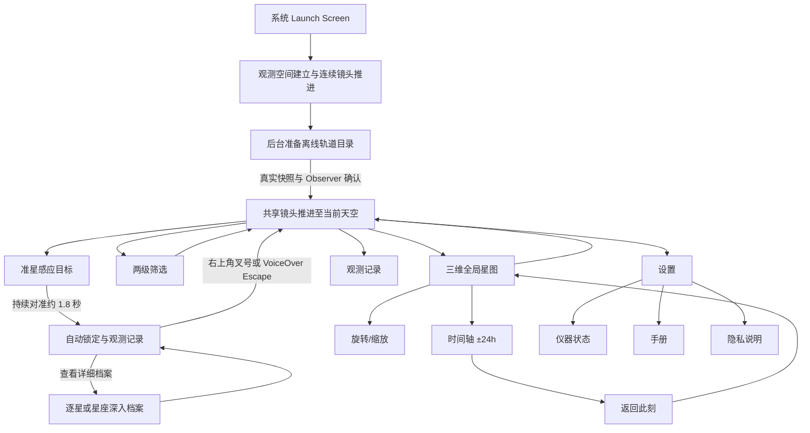

# StarCatch 项目全景说明

> 文档版本：2026-09-15
> 对应应用版本：1.0（Build 1）
> 文档依据：当前 Swift 源码、随包轨道目录、工程配置、测试与发布清单

> 阅读方式：这是产品与运行流程的按需事实源，不是新对话的启动必读材料。新任务先读取
> `../PROJECT_CONTEXT.md`，再用 `rg -n '^##' Documentation/PROJECT_OVERVIEW.md` 定位并只读取
> 与当前功能有关的章节。

## 1. 项目摘要

StarCatch 是一款面向 iPhone 的人造天体观察应用。用户举起手机后，应用根据设备姿态、真北方向、观察者坐标和本地轨道数据，计算此刻位于手机指向区域内的人造天体，并以克制的深空仪器界面呈现卫星、空间站、望远镜、退役航天器和轨道残留。

它并不是通过摄像头识别画面中的亮点，也不是把普通星图贴在屏幕上。当前实现的核心链路是：

1. CoreMotion 提供手机背面视轴在真实世界中的方向。
2. CoreLocation 提供观察者坐标，并协助建立真北参考系。
3. 随 App 打包的 CelesTrak GP/OMM 快照提供轨道元素。
4. SatelliteKit 在设备本地执行 SGP4 传播。
5. 投影系统把方位角、仰角和三维轨道位置映射到主天空或全局星图。
6. 捕获状态机根据准星驻留自动建立持久目标，并管理明确关闭与重新布防。
7. 档案、轨迹、筛选、观测记录和时间轴围绕同一份轨道事实工作。

当前工程已经具备一套完整 iOS 应用所需的主要页面、导航、返回逻辑、设备权限降级、设置、帮助、隐私说明、错误状态和本地记录。它可以作为 1.0 功能候选版本继续进行真机精度验证与 App Store 提交流程。

## 2. 当前工程规模

以下数字来自 2026-09-09 的本地工作区盘点。

| 指标 | 当前规模 |
| --- | ---: |
| 随包轨道对象 | 16,507 个 |
| 人工重点校订档案 | 19 篇 |
| 应用 Swift 源文件 | 51 个 |
| Swift 测试文件 | 3 个 |
| Swift 代码与测试总行数 | 约 23,065 行 |
| 单元测试方法 | 134 个 |
| `StarCatch` 源码与资源目录 | 约 33 MB |
| `catalog.json` | 约 14.4 MiB |
| `satellite_profiles.json` | 约 16.4 MiB |
| 当前工作区 | 约 88 MB，不含 `.git` 与 DerivedData |
| 最低系统版本 | iOS 17.0 |
| 设备方向 | iPhone、竖屏、全屏 |
| 应用版本 | 1.0（Build 1） |

项目只有一个运行时第三方 Swift Package：SatelliteKit。工程精确锁定 2.1.2，
用于本地 SGP4 轨道传播；升级前必须通过 Vallado 近地与深空标准向量回归测试。

## 3. 已完成的用户功能

### 3.1 启动与首次使用

应用已经实现完整的首次进入流程：

- Launch Screen 使用与应用一致的深黑背景，避免系统白屏闪烁。
- SwiftUI 首帧从微弱信号开始，目录和本地星历在后台准备。快速准备路径约 2.6 秒：
  空无 → 地球轮廓/经纬/大陆 → 轨道与真实卫星网络 → Observer → 推进至当前天空 → LIVE。
- 不显示品牌底字、进度条、百分比或启动口号。深黑、暖灰为主，暗琥珀只强调 Observer 与视域。
- 启动以假定上海为构图中心，侧倾 -14°；真实定位确认时连续对准 Observer。
  共享 ObservationSceneRenderer、ObservationSceneFrame 和 ObservationCameraState，
  正式全球页与启动使用同一地球材质、点阵大陆、参考弧、Observer、稳定卫星 ID 和缓存星历。
- 首份真实星历到达前只建立地球与最多六条参考轨道弧，不再使用启动模拟卫星或人为赤道增密。
  真实点云沿用 overviewObjects 约 4,600 个目标的稳定预算，点亮顺序按倾角组与 ID 确定。
- 推进连续解除全球高度压缩，沿观察者法线靠近地表，后半程转向设备朝向。
  地球依据几何裁切退出，目标在末端与主天空 Projection 一致；准星和必要 UI 末段出现。
- 真实准备较慢时已建立的结构继续低速运行与微弱呼吸；不重播前段。8 秒仍无首份可用星历时
  进入可操作天空并保留数据状态；目录错误直接进入数据不可用界面。后台暂停，返回不重播。
- 已授权定位在建立期间请求；Observer 阶段最多额外等 0.8 秒，未获得合格结果时显示“假定位置”。
  首次未授权用户进入天空后才收到权限请求；假定位置不触发确认触觉，真实确认仅一次。
  推进锁定坐标版本，迟到结果在交接后更新；低精度和手动方向状态不伪装为校准成功。
- 主天空在动画中挂载，接管后保留实例；启动期关闭天空手势、捕获驻留、自动锁定与记录。
- Reduce Motion 使用短暂分层显现和 0.16 秒就地交接，不旋转、不坠入、不呼吸。
- 首次启动不插入额外介绍页，五页观测手册仍可从设置中按需打开。

五页手册当前包含：

1. 这台仪器：说明应用帮助用户感知肉眼不可见的人造天体。
2. 如何观察：说明准星、边缘方向提示、自动锁定和持久信息面板。
3. 时间坐标：说明全局星图与时间轴的关系。
4. 数据与坐标：说明 SGP4、CelesTrak、数据龄期、位置和姿态用途。
5. 观测就绪：说明设置、手册与隐私入口。

### 3.2 主天空与设备指向

主页面是实时捕捉视野，已经实现：

- 真机使用 CoreMotion 以 60 Hz 获取设备姿态。
- 视轴采用手机背面法线，符合“举起手机向外观察”的直觉。
- 获得定位权限并满足系统条件时使用真北参考系。
- 磁场校准质量不足时不会把方向伪装成可靠真北，而是标记为未校准。
- 四元数使用 slerp 低通，降低手部细小抖动造成的点位跳变。
- 正对天顶时使用真北投影作为备用参考，避免计算产生 NaN 或整片天空消失。
- 模拟器自动切换为手动指向源，可通过拖拽改变方位和仰角。
- 应用进入后台时停止姿态和轨道定时任务，回到前台后恢复。
- 灵动岛左翼以精巧信号灯配合状态文字：未捕获与降级为红、感知和对焦为黄、识别成功及锁定为绿；
  关闭时逐渐收暗。右翼 AZ / EL 固定标识，整数数值以最高 6Hz 上下滚动，抑制动效时直接更新。
- 状态文字直接解释具体原因：运动数据受限、定位未授权、正在定位、使用估算位置、定位精度较低、
  方向未校准、轨道数据较旧。运动不可用最高优先，其后捕获事件优先于一般环境提示；环境问题按
  定位、方向、轨道数据排序。锁定后持续显示“已锁定”，完整原因与目标编号保留在无障碍朗读中。

主天空以 30 fps 的 `TimelineView + Canvas` 绘制。点位在真实传播帧之间进行插值，因此卫星会连续移动，而不是每次轨道刷新时跳切。

### 3.3 相机式局部放大

主天空支持双指捏合：

- 基础竖向视场为 55°。
- 最大放大倍率为 4×。
- 放大围绕固定的中央准星进行，手机姿态仍然决定镜头朝向。
- 缩放偏离默认值超过 8% 才出现“复位视场”，回到 3% 内消失，捏合期间隐藏。
- 手动浏览偏离本轮拖动前方向超过 3° 时也提供复位；恢复到 1° 内消失。复位停止惯性，恢复
  手动浏览前的方向与默认缩放；真机姿态跟踪不因正常转动出现方向复位。控件表面 32pt、热区 44pt。
- 全局星图出现时，主天空手势停止接收缩放，避免父子视图同时响应。

### 3.4 卫星感应、自动锁定与关闭

捕获系统只有一条自动流程，不再提供确认捕获设置或确认、切换、取消捕获按钮：

- 准星进入目标附近后显示感应与驻留反馈。
- 持续对准约 1.8 秒后自动锁定，弹出持久信息面板，并写入一次观测记录。
- 锁定后移动手机、让目标离开准星或对准另一目标都不会更换或关闭当前信息。
- 信息面板只通过右上角叉号关闭；VoiceOver Escape 是等价无障碍入口。背景点击和下滑不关闭。
- 关闭使用 0.24 秒收束动画，完成后恢复四槽导航；Reduce Motion 下使用短淡出。
- 同一目标关闭后必须真正离开 4° 退出范围才会重新布防，不使用定时抑制。若关闭时已经对准
  另一目标，它可在关闭完成后立即开始新的驻留。

状态机使用明确阈值和迟滞：

| 项目 | 当前值 |
| --- | ---: |
| 进入感应范围 | 2.5° |
| 核心捕获范围 | 1.25° |
| 离开感应范围 | 4.0° |
| 自动锁定驻留 | 1.8 秒 |
| 聚焦移开退出迟滞 | 0.75 秒 |
| 关闭动画 | 0.24 秒 |

角度范围会随主视野光学放大换算成对应屏幕距离，因此 4× 长焦下不会继续使用过宽的屏幕捕获半径。

### 3.5 目标反馈与信息面板

从接近目标到读取信息，当前已经形成连续视觉关系：

- 常驻层只保留准星、低强度方位参考，以及底部同尺寸的筛选、观测记录、全球轨道和设置入口；
  启用筛选只以暗琥珀小标记提示，不常驻名称或数量。
- 导航基座高 56pt，保留 18pt 留白与 24pt 圆角，激活项只在图标后留小底色及 12×2pt 短线。
  8 秒无触摸后整体淡至 0.72；视线转速超过 6°/秒持续 0.25 秒后淡至 0.35，低于 2°/秒
  持续 0.8 秒退出移动态。触摸底栏及上方 16pt 区域恢复至少 3 秒，按钮仍一次点击直达。
  VoiceOver / Increase Contrast 不自动减淡；Reduce Motion 使用短淡化。
  固定尺寸的状态翼与导航短标签将字号上限设为 XXXL 并按宽度适配；完整说明与页面正文继续跟随
  系统大字号，无障碍标签保留完整语义。
- 主天空背景恒星使用更暗的中性色；普通卫星（含精选对象）保持物理分档和微型人工结构，当前
  候选才拥有暖白光晕与捕获进度，已锁定对象拥有暗琥珀结构。候选退出用 0.24 秒淡回普通层，
  Reduce Motion 为 0.14 秒；启动与全球共享场景与镜头，但不驱动捕获业务。
- 感应层让导航退场，显示目标、捕获环和驻留进度。
- 自动锁定后才显示持久摘要、遥测和深度入口。

- 目标靠近准星时逐步增亮。
- 捕获环根据驻留进度收紧。
- 初次感应会触发一次性扫描效果。
- 信息面板稳定停留在底部阅读区域，不跟随准星或目标换位。
- 主天空中的锁定标记、真实轨迹与离屏信标继续按设备方向和目标位置更新，摘要自身保持稳定。
- 目标转出屏幕后，信息面板仍保持可读。
- 已捕获目标转出屏幕时，边缘信标和方向结构继续指示目标所在方向。
- 点击叉号后正文与锁定结构共同收束，不暴露“释放”业务动作。

普通档案按阅读深度分为三层：

- 第一眼：微型标签只显示 COSPAR、当前距离与轨道层级。
- 稳定阅读：底部摘要依次显示名称、任务类型、在役状态、轨道类别、按真实对象类型生成的简短
  中英文描述，以及低层级的距离、高度和速度遥测；右上角只有一个 44pt 热区的叉号。
- 深入档案：先用任务角色、用途短句和可信身份说明“它是什么、用来做什么”，再通过
  “此刻／任务／数据”三种阅读视图组织未来 24 小时过境、当前天空、任务资料、轨道参数、
  历程和结构化来源。

准星刚刚感应目标时只显示第一层；完成自动锁定后才开放持久摘要和遥测。底部摘要不再绘制简易
过境线图，完整洞察图仍保留在深度档案中，真实轨迹仍由主天空 Canvas 绘制。

### 3.6 深度任务档案

3,817 个非大型星座对象按 NORAD 各自拥有一份可编辑的离线 Markdown；
Starlink、OneWeb、千帆、国网、Kuiper、Iridium、Globalstar 与 Orbcomm
各自拥有一份项目共享档案，覆盖其全部真实轨道节点。人工重点校订的历史任务
保留更长的章节，基础档案则提供可继续完善的真实身份与任务结构。

深度档案包含：

- “此刻”页的未来 24 小时地平线上方过境时间带，以及可选择的升起／最高点／落下曲线。
- 当前方位、仰角、距离趋势、星下点，以及周期、倾角、偏心率、近地点与远地点参数。
- 当前 NORAD / COSPAR 身份、发射批次与大型星座内的相对位置。
- 严格分开的本星资料与系列背景。
- 关键历史节点、任务事实和带可信类型、资料范围、URL、获取/核验日期的结构化来源。

人工重点校订对象包括：

- Vanguard 1、Telstar 1、LAGEOS 1。
- Hubble、国际空间站、天宫空间站。
- Intelsat 901 / MEV-1。
- Envisat、Sentinel-2、Sentinel-6。
- Terra、Aqua、MetOp-B、Himawari-9、NOAA-20。
- Galileo 代表星、Landsat 9、SWOT。

完整即时信息出现时，“查看档案”属于底部摘要卡自身。单体卫星读取自己的档案；大型
星座成员共享经过核实的系列背景，但当前身份、轨道参数、批次与实时洞察保持独立。

### 3.7 双语资料与轨道动效

StarCatch 提供互斥的简体中文与英文界面，选择权完全交给 iOS 系统及单 App 语言设置；
英文是不支持语言的回退。品牌、官方名称、NORAD / COSPAR、AZ / EL、轨道缩写和标准
单位保持原文，其余导航、状态、资料、错误、权限与辅助功能信息必须按当前语言完整显示。

`catalog.json` 只保存身份、分类和轨道事实，不再携带某一种语言的长文。自动档案由结构化
事实和 `SatelliteText.xcstrings` 在展示时生成；精选与系列资料继续保存可审阅来源，英文
展示采用同等可信边界的独立结构化表达。旧观测日志只恢复身份与轨道快照，不恢复旧语言正文。

摘要只在存在真实窗口时使用 `SatelliteMotionSignature` 呈现紧凑过境弧。深入档案改用
`PassForecast`：轨迹只绘制一次，当前时刻线、倒计时和正在过境的位置以 1Hz 更新；GEO
保持站位摘要，不伪造升落曲线。任何帧更新都不会触发 SGP4、文件读取或目录遍历。

### 3.8 屏幕边缘方向提示

当手机指向空域或目标位于屏幕之外时，应用会从真实投影结果生成边缘提示：

- 只为地平线上方且与当前视轴角距合理的目标建立候选。
- 提示方向来自目标的方位和仰角，不是随机装饰。
- 候选会进行重叠抑制，避免同一方向出现大量箭头。
- 已捕获目标使用连续的边缘标记，进出屏幕边界时不会突然换成另一套坐标。
- 联系线止于档案边缘，不穿过正文。
- 目标被档案遮住时只显示短缺口，不在文字后面画完整目标。

### 3.9 大型星座点位

应用保留完整星座节点，但不会在默认天空里同时画出一万多个近似重复点。

当前可识别的星座家族和本地节点数量为：

| 星座家族 | 本地识别节点 |
| --- | ---: |
| Starlink | 11,078 |
| OneWeb | 651 |
| 千帆 | 238 |
| 国网 / Hulianwang | 191 |
| Project Kuiper | 391 |
| Iridium | 80 |
| Globalstar | 36 |
| Orbcomm | 14 |

默认展示逻辑：

- 完整天空中的大型星座普通节点先做稳定抽样，减少每帧传播与绘制压力。
- 主天空和全局星图中的每一个可见点都对应一个真实 NORAD 目录对象。
- 不再生成虚拟质心、群组标记或节点数量标签。
- 精选或策展节点始终保留独立身份。
- 当准星感应某个星座成员时，同家族真实点位只做轻微整体增亮。
- 各星座使用低饱和身份光谱，只改变外晕和轨迹，不把天空变成彩色点阵。

### 3.10 两级卫星筛选

筛选从四槽控制基座的等宽入口向上生长为固定大面板。顶栏下固定显示当前筛选摘要与结果数量；
显示范围标签始终在前，任务、机构和星座标签按既有分组顺序排列，每个标签都可单独移除。
无筛选时摘要回退为“全部轨道”，有筛选时可一步重置。下方先显示“全部轨道、可读档案、
载人与科学、地球观察”四个常用镜片，再完整保留显示范围、任务、机构和星座选项。所有选择
实时写入 `SkySession`，返回只关闭页面，不撤销结果。

选择筛选后，会同时更新：

- 主天空可见对象。
- 主天空绘制抽样。
- 全局星图抽样。
- 轨迹抽样。
- 后续后台传播目标集合。

当前 4 个一级类别、16 个二级筛选为：

| 一级类别 | 二级筛选 |
| --- | --- |
| 浏览 | 全部轨道、可读档案 |
| 任务 | 载人与科学、地球观察、导航与授时、通信基础设施、历史与遗产 |
| 机构 | 美国公共任务、ESA / Copernicus、中国公共任务、其他公共任务 |
| 星座 | Starlink、OneWeb、中国低轨网络、Project Kuiper、移动通信网络 |

页面摘要明确显示当前结果数量；每个镜片突出名称与一句观察作用，并始终提供一步恢复“全部轨道”。数量与天空使用同一数据源计算。测试要求每项都满足：

- 结果非空。
- 除“全部轨道”外，确实缩小目录。
- 至少保留数个有策展文字、机构说明、公共任务说明或星座共同资料的目标。
- 每个具体镜片至少保留 80 个真实对象；小型结果不再二次抽稀。
- 每个具体镜片只属于一个一级类别。

机构归属只在公开名称足以可靠辨认时建立。未知对象不会为了填满筛选而被猜测属于某个组织。

### 3.11 三维全局星图

探索态中央“全局轨道”是地心三维轨道场的直接入口。主天空缩到最广视场后继续明显缩小时，
同一个入口会增强并给一次阈值触觉，但仍不会因手势越界自动切换。该页面与主天空共享同一份
ECI 轨道传播结果，不是静态示意图。

已实现：

- 带方向光、昼夜暗部、受光大气边缘和点阵大陆的悬浮球形地球；海岸附近使用更细的点，
  内陆使用稍大的低亮度点，拖动与缩放期间仍保持完整陆地识别。
- 深色半透明球壳、内外双层轮廓、冷白灰绿大气弧、镜面反射与深度衰减经纬网共同形成
  “精密线框观测仪”，琥珀色只保留给当前位置、默认视域和交互信号。
- 启动、全球和局部天空使用同一确定性 StarDust 背景身份，连续响应设备方向；地球旋转、惯性
  和缩放均不会带动背景。离线 J2000 星表与投影工具保留，但不在全球页另画第二套背景。
- 前后景深度区分进一步拆成背面、地球盘面、外侧壳层和近景四档；盘面目标退成测量点，
  前景地球边缘在卫星层之后重新建立清晰遮挡。
- 当前观察者使用共享菱形标记和球面视域，假定位置与低精度持续提示；点按标记可短暂查看坐标。
- 约 4,600 个稳定抽样的真实目录目标形成轨道壳层；完整微型人造结构仅用于策展目标和稳定稀疏样本，
  并沿地球切线排布，不再让每个目录节点都与大陆争夺层级。
- 当前捕获对象与相关星座家族强调。
- 单指水平和垂直旋转。
- 拖动结束后的惯性收束。
- 主天空在 0.52×–4× 内独立缩放；最广视场之后的额外行程只提供入口阻力和触感，不直接生成地球。
- 地球仪默认以 0.82× 展示，双指缩放范围约 0.72×–2.2×；达到边界后只做阻尼收束，绝不触发
  返回主天空。
- 默认镜头以观察者经度为中央经线，未授权定位时对准上海经度；地轴的屏幕投影保持竖直、赤道
  与纬线保持水平。空闲时地球、大陆、观察者、卫星、轨道与拖尾沿地球极轴以 180 秒一圈缓慢同步旋转，
  因此地表沿赤道左右展开，背景不跟随地球旋转。触摸旋转、缩放或拨动时间会立即暂停，相关惯性
  结束 2 秒后从原角度续转。
- 双击复位默认朝向、0.82× 缩放和自动旋转相位；系统或 App 开启 Reduce Motion 时自动旋转关闭。
- 顶部使用位于灵动岛下方的整条全球模式栏：左侧使用与筛选、记录、设置相同的向下返回天空
  控件与水平锚点，中部标明全球轨道，右侧显示 LIVE 或时间偏移；本地天空专属的 AZ / EL
  不进入全球页。四个底栏目的根页都支持点击、顶部下拉和 VoiceOver Escape 返回天空。
- 底部只保留常驻时间轴，占据主天空四槽控制基座的位置；全球页不直接提供筛选、观测记录和
  设置入口，也不再显示目录计数、额外 LIVE 信息条或复位按钮。
- 模式栏左侧“天空”为可见返回入口，并为 VoiceOver 保留 Escape 等效动作；返回后恢复 LIVE
  与 1× 默认陀螺仪视场。
- 进入和退出共用一条单调相机后退时间轴：天空穹顶、地球尺度、轨道密度、地表细节和控件
  分阶段交接；锁定卡也随局部界面退出，不在地球建立后继续遮挡主体。
- 转场复用局部天空已传播的稳定目标集合，不在临界点突然切换点集或启动完整目录传播。

### 3.12 时间轴与过去/未来观测

时间轴只存在于全局星图，主天空不常驻时间轴。它在全球页底部始终可见，并随全球页转场淡入
淡出；非 LIVE 时中央偏移读数直接提供“回到此刻”操作。

时间系统已经实现：

- 可选择当前时刻前后各 24 小时。
- 拖动刻度时实时更新相对时间和具体时间标识。
- 刻度换算为每移动 1 pt 对应 12 秒。
- 支持拖动惯性，但最终偏移始终限制在 ±24 小时。
- VoiceOver 可调操作保留相同边界，并提供命名的“回到此刻”动作。
- 非 LIVE 状态按选定时刻重新传播全部当前筛选对象。
- 拖动期间三维卫星位置连续变化。
- 时间移动和 LIVE 运动都会生成有界光轨。
- 非 LIVE 的“返回此刻”收进全球控制台遥测行。
- 返回时长按偏移距离线性缩放，最短约 0.38 秒，最远 24 小时不超过 2.4 秒。
- 返回过程中主天空和全局星图均保留可读的回归轨迹。
- 从非 LIVE 状态退出全局星图时，会先归还到当前时间。

### 3.13 轨迹与过境预报

轨迹系统包含三种不同用途：

- 主天空捕获轨迹：以目标当前时刻为中心，采样前后各 3 分钟，每 20 秒一个点。
- 时间移动轨迹：表现用户拖动过去或未来时，目标从旧位置到新位置的变化。
- 全局星图为当前锁定对象保留约 10 fps、最长约 9 秒、最多 90 点的完整真实空间轨迹。
- LIVE 且完全静止 0.35 秒后，最多 24 个确定性真实目标可显示独立环境拖尾：ECI 历史最多
  3.2 秒 / 32 点，端点保持真实，旧点只在屏幕空间按运动方向放大且尾长不超过 22pt。
  拖动、缩放、旋转、惯性、转场、时间移动或 Reduced Motion 会立即清空这组环境拖尾。

过境预报只在用户读取具体目标时低频计算：

- 扫描未来 24 小时。
- 先以 60 秒步长寻找地平线穿越。
- 找到穿越后通过二分细化到约 2 秒。
- 当前在地平线下时显示下一次升起。
- 当前可见时显示预计落下。
- GEO 且一小时仰角变化小于 0.5° 时显示常驻。
- 深度档案最多输出八个升起、最高点、最大仰角、落下和起落方位组成的完整窗口。
- 完整预测按对象、粗粒度观察者坐标和十五分钟时间桶缓存；关闭档案或切换目标会取消旧任务。
- 计算位于 utility 后台任务，并且只在打开深度档案时启动；首次对焦和摘要卡不会等待
  24 小时扫描才出现。

### 3.14 观测记录

观测记录是完整的二级功能，不只是“清除记录”按钮。

每次自动锁定目标时，应用会：

- 以对象 ID 去重，同一对象累计次数。
- 保存首次捕获和最近捕获时间。
- 保存实际观测时刻。
- 保存当时的方位、仰角、高度、距离和速度。
- 保存类别、COSPAR、NORAD、轨道类型、发射信息、状态和任务文字快照。
- 最近观测对象排在列表前方。

观测记录从主天空四槽控制基座向上生长为固定大面板：

- 查看已识别对象数和总捕获次数。
- 使用原生 `List` 按日期分组，以无卡片的扁平时间线显示每个对象的最近观测时间和累计次数。
- 点击记录在同一面板的独立导航栈内进入详情页。
- 即使未来目录更新后对象不再存在，也可以使用记录时保存的档案快照恢复详情。
- 单条记录使用系统左滑删除；“清除全部”位于顶部统计区域，并通过系统确认对话框防止误删。
- 清除观测记录不会删除显示偏好或手册状态。

数据使用 `UserDefaults` 本地保存，不创建账户，也不进行云同步。

### 3.15 设置、状态、帮助与隐私

设置从底部四槽控制基座向上生长为固定大面板。根页展示显示偏好、系统状态、手册、
隐私、系统设置入口和版本信息，不再重复展示观测记录摘要。系统状态由设置流自己的
`NavigationStack` 在面板内推进，包含：

显示与交互设置：

- 介质颗粒：即时控制 Metal 颗粒和扫描纹理。
- 抑制动效：冻结漂移与呼吸，缩短页面和档案转场。

仪器状态页：

- 当前观察者坐标及是否为假定位置。
- 定位权限状态。
- 当前方位、仰角和指向置信度。
- 姿态服务是否追踪。
- 离线目录对象数量、快照日期和数据龄期。
- 运行方式明确标记为 Offline / On Device。
- GitHub 支持、项目源码和开源许可入口。
- 定位被拒绝时提供前往系统设置的恢复入口。

帮助与隐私：

- 可重新打开五页观测手册。
- 应用内提供完整隐私说明。
- 提供公开隐私政策和支持链接。
- 三个工具面板占底部锚点到顶部安全区可用高度的 84%，保留基座 18pt 留白与 24pt 圆角。
  展开约 0.48 秒、收回约 0.32 秒：按钮先退场，标题和正文依次上浮淡入，无缩放和弹跳。
- 筛选、记录、设置和仪器状态统一使用 56pt 顶栏：左返回、右标题。筛选、记录、全球、设置
  四个底栏目的根页共用向下返回天空控件、44pt 热区和固定水平锚点，并支持顶部下拉与
  VoiceOver Escape；工具面板还可由外部点击收回。子页保留左缘返回上一层，手册、隐私和
  深度档案保持沉浸式阅读。
- 面板共享暖黑正文与底部表面材质；覆盖期间天空冻结但不变黑、不能交互，底部导航不可见。
  Reduce Motion 使用 0.14 秒淡化，Reduce Transparency 使用实色表面。
- 固定 56pt 顶栏的动态字号最高为 XXX Large，保证按钮与标题可读；滚动正文仍支持完整无障碍字号。

### 3.16 无障碍与降级

当前实现包含：

- 支持系统 Reduce Motion，并提供应用内抑制动效开关。
- 图标按钮提供无障碍标签和操作提示。
- 筛选项提供选中状态、观察作用和结果数量的辅助功能描述；顶部摘要同步显示筛选标签与数量。
- 三维星图提供旋转、缩放和复位的无障碍说明与复位动作。
- 标准字号下设置页尽量单屏完成；小屏或放大字体时允许滚动。
- 定位拒绝时使用上海假定坐标并明确标注，不阻断应用。
- 真机无 CoreMotion 时降级为手动指向源。
- 轨道目录缺失或解析失败时显示明确错误页面，而不是黑屏。
- 前后台生命周期会停止和恢复昂贵服务。

## 4. 完整用户流程



## 5. 轨道数据与真实性边界

### 5.1 当前随包快照

`StarCatch/Resources/catalog.json` 当前记录：

| 字段 | 值 |
| --- | --- |
| Schema | 2 |
| 快照时刻 | 2026-09-09 15:49:30 UTC |
| 生成时刻 | 2026-09-09 15:49:30 UTC |
| 来源标识 | CelesTrak GP/OMM · runtime offline snapshot |
| 对象总数 | 16,507 |

任务语义分布：

| 类别 | 数量 |
| --- | ---: |
| 网络、通信与导航 | 13,809 |
| 探索、驻留与科学 | 1,924 |
| 地球与气象观测 | 764 |
| 轨道遗产与残留 | 10 |

目录状态分布：

| 状态 | 数量 |
| --- | ---: |
| Active | 16,497 |
| Silent | 4 |
| Derelict | 4 |
| Debris | 2 |

### 5.2 数据使用原则

- App 运行时不联网下载轨道数据。
- 所有轨道目标的位置都由本地元素和 SGP4 计算得到。
- NORAD、COSPAR、轨道类别和元素历元保留真实目录身份。
- 大型星座只做稳定的真实对象抽样，不生成虚拟聚合点。
- 深度故事通过 NORAD ID 与轨道对象关联。
- 公共任务功能说明只用于名称可以可靠辨认的系列。
- 未公开载荷只陈述可核实的轨道身份，不推断具体用途。
- 机构筛选不是完整所有权数据库；没有足够证据的对象保持未分类。

### 5.3 必须理解的限制

- TLE / OMM 是轨道估计数据，不是运营方实时遥测。
- LEO 元素会随时间老化，发布后必须定期更新随包目录。
- 运行时完全离线意味着用户不能在不升级 App 的情况下获得新快照。
- 真机对准精度同时受陀螺仪、磁场、定位、握持姿势和设备校准影响。
- 应用展示的是计算方向，不代表卫星一定能被肉眼或相机看到。
- 云层、光照、地球阴影和视星等当前不参与可见性判断。

## 6. 技术架构

### 6.1 技术栈

- UI：SwiftUI。
- 高频绘制：Canvas + TimelineView。
- 介质效果：Metal Shader。
- 姿态：CoreMotion。
- 位置：CoreLocation。
- 轨道传播：SatelliteKit / SGP4 / WGS-72。
- 本地持久化：UserDefaults + Codable。
- 工程生成：XcodeGen。
- 最低部署：iOS 17。
- iOS 26 及以上：四槽控制基座、全球轨道控制台与功能胶囊使用统一 Liquid Glass 容器；
  iOS 17–25 使用同布局的超薄材质、深黑覆层和统一描边。工具面板正文保持稳定暖黑暗色材质。

### 6.2 运行时依赖方向

```text
RootView
├── SkySession
│   ├── CatalogStore
│   ├── EphemerisEngine
│   ├── ObserverLocation
│   ├── TrackSampler
│   ├── PassPredictor
│   ├── SatelliteInsightEngine
│   └── ObservationLog
├── SkyClock
├── CaptureStateMachine
├── AppPageDestination
└── SkyView
    ├── SkyChromeState
    ├── SkyCommandConfiguration / SkyCommandDock
    ├── GlobalOrbitHeader
    ├── Projection
    ├── SkyRenderer
    ├── TrailStore
    └── 独立 SwiftUI 控件与档案页面
```

架构原则是：轨道层不知道 SwiftUI 页面，绘制层不拥有业务状态，页面不直接解析目录或自行执行 SGP4。

### 6.3 状态所有权

| 状态 | 唯一所有者 |
| --- | --- |
| 启动、全屏阅读与互斥工具页 | `RootView` / `AppPageDestination` |
| 姿态、位置、目录、筛选与星历服务 | `SkySession` |
| 当前、过去和未来观测时刻 | `SkyClock` |
| 探索、聚焦、自动锁定和关闭消隐 | `CaptureStateMachine` |
| 主天空局部缩放、互斥临时 Overlay 和过渡 | `SkyView` |
| 控制层动作优先级 | `SkyChromeState`（纯值推导） |
| 短生命周期光轨 | `TrailStore` |
| 本地观测记录 | `ObservationLog` |

### 6.4 性能策略

16,507 个对象不能按传统 SwiftUI 子视图逐个建立。当前工程采用：

- JSON 只在目录加载时解析一次。
- 目录读取、JSON 解码、SatelliteKit 对象和筛选索引在首帧之后于后台构建。
- 启动与全球共享缓存的稳定卫星样本、预计算地理数据与六条参考弧；30fps 路径不执行目录解析、
  文件 IO、SGP4 或对象构造。一次相机变换驱动全部几何，主天空不在底层重复全量绘制卫星。
  档案、轨迹和洞察预热独立于首帧准备；Reduce Motion 关闭空间运动。
- 目录预建 ID、类别和星座家族索引。
- ISO-8601 格式器复用，不为每条记录创建实例。
- 大型星座确定性抽样，精选对象始终保留。
- 普通点位在 Canvas 中按类别批量绘制。
- 只有当前聚焦或锁定目标、精选和策展对象绘制独立环、呼吸和扫描细节。
- SGP4 批量传播在后台任务中执行。
- 主线程一次性接收完整帧，不逐对象发布状态。
- LIVE 帧每 4 秒真实传播一次，帧间连续插值或短时外推。
- 时间轴快照使用 0.25 秒时间桶，连续手势只保留最新请求。
- 筛选变化会取消旧传播任务，避免旧的 16k 帧覆盖新结果。
- 精确高度和速度只在读取单颗目标时计算并缓存。
- 过境、轨迹和格式化都具有独立缓存或低频入口。
- 系列中位数和发射批次索引只在目录构建时生成一次；单目标洞察在感应阶段异步预热。

### 6.5 主要代码目录

| 目录 | 职责 |
| --- | --- |
| `StarCatch/App` | 应用入口、启动流程、顶层页面编排、隐私页和外部链接 |
| `StarCatch/Design` | 色彩、字体和动效常量 |
| `StarCatch/Sky` | 主天空、三维星图、时间轴、筛选、投影、绘制、拖尾和交互控件 |
| `StarCatch/Pointing` | 真机姿态、模拟器手动指向和观察者位置 |
| `StarCatch/Orbits` | 目录模型、解码、传播、轨迹、过境和观测日志 |
| `StarCatch/Engagement` | 捕获状态机 |
| `StarCatch/Archive` | 即时档案、深度故事、设置、状态、观测记录和手册 |
| `StarCatch/Shaders` | 颗粒与扫描纹理 |
| `StarCatch/Resources` | 离线轨道目录 |
| `StarCatchTests` | 轨道、投影、姿态、时间、轨迹、日志和状态机测试 |
| `Scripts` | 发布期目录下载、合并、分类和校验 |

## 7. 视觉与交互语言

### 7.1 色彩

- 基底不是纯黑，而是略带介质感的 `voidBlack`。
- 主要文字使用暖纸白和暖灰，不使用高亮纯白。
- 暗琥珀色 `signal` 只承担交互和锁定信号。
- 探索、观测、网络、遗产和大型星座使用低饱和身份光谱。
- 卫星核心仍保持纸白，类别颜色只出现在外晕、轨迹和筛选图标中。

### 7.2 字体与信息层级

- 名称、任务标签和遥测采用明确的等宽仪器语汇。
- 中文说明使用较轻字重和克制字号。
- 信息层级主要依靠透明度、间距和字重，不依靠大面积色块。
- 说明文字不追求与按钮同等亮度，避免抢夺准星和卫星主体。

### 7.3 动效

- 临时界面展开较快、尾段缓慢收束。
- 收起比展开更果断。
- 点位淡入而不是弹出。
- 档案先建立外壳，再逐层显影正文。
- 退出时正文、联系线和目标结构按空间关系反向回收。
- 场景切换、全局星图和时间回归使用不同节奏。
- Reduce Motion 会关闭持续漂移、呼吸与不必要的长转场。

## 8. 隐私、安全与本地数据

当前版本：

- 不创建账户。
- 不包含广告。
- 不包含分析 SDK。
- 不包含用户跟踪。
- 不上传位置和姿态。
- 不上传观测记录。
- 不在运行时请求轨道网络数据。
- SatelliteKit 仅在设备本地执行计算。

本地保存内容包括：

- 是否启用颗粒。
- 是否抑制动效。
- 时间轴是否已交互。
- 首次捕获提示状态。
- 观测记录及其轨道快照。

工程已经包含 `PrivacyInfo.xcprivacy`，声明不跟踪、不收集，并为 UserDefaults 提供所需 API 使用理由。应用内隐私页、公开隐私政策和工程声明需要在发布时保持一致。

## 9. 测试与验证

当前测试代码包含 60 个测试方法，主要覆盖：

轨道与目录：

- 16k 离线目录加载、去重和代表对象身份。
- 筛选非空、筛选数量、可读资料覆盖和两级归属完整性。
- 大型星座识别、真实点位采样与目录总数保留。
- NORAD / COSPAR 标识合理性和元素时效。
- ISS 高度与速度的物理合理性。
- GEO 一小时近似静止。
- 过去或未来时刻与直接传播结果一致。

指向与投影：

- 真北和正东方向的设备视轴映射。
- 天顶姿态有限值。
- 磁场校准与置信度。
- 目标位于东方或更高仰角时的屏幕方向。
- 主视野放大后的光学视场。
- 目标进出边缘时的连续性。
- 联系线不会穿过档案文字。

交互状态：

- 捕获角度阈值。
- 1.8 秒前不锁定，完成驻留后自动锁定。
- 手部抖动下的驻留记忆。
- 锁定目标移出准星后仍保持捕获。
- 锁定期间忽略其他候选，不自动换星。
- 叉号关闭后同目标必须离开 4° 才能重捕获，另一目标可立即开始驻留。
- 一次锁定只写入一次记录，重新完成锁定后正确累计。

时间与轨迹：

- ±24 小时限制。
- 时间轴呈现状态与选定时间分离。
- 返回 LIVE 同时退出临时全景状态。
- 返回时长随偏移线性缩放且不超过 3 秒。
- 时间拖尾和 LIVE 三维拖尾。
- 三维旋转与缩放投影。
- 下一次过境和倒计时格式。

记录与生命周期：

- 观测记录真实快照持久化与清除。
- 页面动效时长不会超过捕获生命周期。
- 会话发布最新手动姿态样本。

最近一次工程验证基线：iPhone 17 / iOS 26.3 Simulator Debug 构建与逐态运行成功；
完整测试集 134/134 通过，包含四槽配置、Chrome 优先级、工具页路由、Overlay 互斥、材质回退、真实惯性时基与
iPhone 17 / Air / Pro Max / 375pt 顶部几何回归。

## 10. 构建、开发与数据维护

### 10.1 本地运行

```bash
brew install xcodegen
xcodegen generate
open StarCatch.xcodeproj
```

真机：

1. 在 Xcode Signing 中选择有效开发 Team。
2. 连接 iPhone。
3. 允许定位和运动传感器权限。
4. 在远离强磁场和大面积金属的位置完成方向校准。

模拟器：

- 直接运行即可。
- 水平拖拽改变方位角。
- 垂直拖拽改变仰角。
- 主天空和全局星图的双指缩放可以使用模拟器手势。

### 10.2 工程生成规则

`project.yml` 是 Xcode 工程结构和 Info.plist 声明的来源。增加、删除或移动源文件后必须运行：

```bash
xcodegen generate
```

不应只在 Xcode Build Settings 中修改可由 `project.yml` 表达的配置，否则下次生成会丢失。

### 10.3 更新离线目录

统一使用：

```bash
python3 Scripts/update_catalog.py --refresh-active
python3 Scripts/satellite_knowledge.py sync
python3 Scripts/satellite_knowledge.py validate
python3 Scripts/satellite_knowledge.py compile
```

更新脚本负责：

- 按 CelesTrak 使用策略请求 GP/OMM 数据。
- 合并多个公开轨道分组。
- 合并 `Scripts/catalog-curated.json` 的策展元数据。
- 去重并保留唯一对象身份。
- 分类任务类别、状态和大型星座家族。
- 校验数量、标识、历元和代表对象。
- 输出 App 可以离线解码的 schema 2 文档。

发布前不要手工替换单颗卫星的元素，也不要让 App 运行时偷偷访问目录网络。

## 11. App Store 完成度

### 11.1 工程内已经完成

- 独立 Bundle ID 和显示名。
- 1024×1024、无透明通道 App Icon。
- 黑色 Launch Screen。
- 定位与运动用途说明。
- 应用内隐私说明。
- Privacy Manifest。
- 无跟踪、无数据收集的当前实现。
- 定位拒绝后的假定坐标降级与系统设置恢复入口。
- 本地观测记录查看、详情和删除。
- 前后台生命周期。
- 轨道目录缺失错误页。
- Reduce Motion 支持。
- 真实版本号显示。
- 非豁免加密声明为 false。
- MIT License、第三方许可与 CelesTrak 归属。
- Archive 前要求目录在 72 小时内刷新，并校验档案来源闭合、隐私清单、图标、版本来源和依赖锁定；14 天只保留为开发生成器的绝对失效上限。
- 6.9 英寸简体中文原始商店截图与可直接填写的元数据、审核说明和答卷草案。

### 11.2 仍需开发者账号持有人完成

- 确认正式应用名、副标题、分类与已准备的关键词。
- 建立 App Store Connect App Record。
- 配置分发证书与 Provisioning Profile。
- 填写新版年龄分级问卷。
- 填写 App Privacy 问卷。
- 确认支持 URL、隐私政策 URL、版权主体和联系邮箱。
- 复核并上传 `AppStore/Screenshots` 中已准备的 App Store 截图。
- 复核并提交已准备的审核备注；它已说明真机使用姿态和定位，模拟器使用拖拽。
- 建立 TestFlight 内部和外部测试流程。
- 在真实设备、不同地区和不同磁场环境中完成最终指向验收。
- 确定轨道快照的发布更新周期。
- 确认 DSA 商家身份、销售地区、税务/银行、出口合规与适用地区许可。
- 提供满足商店和当地法规的公开支持联系方式，并确认 CelesTrak 数据的商用分发权利。

### 11.3 当前判断

从页面和功能完整度看，StarCatch 已经不是原型，而是可以进入发布候选阶段的完整应用。当前最大的上架风险不是缺页面，而是：

1. 真机方向精度需要在多台设备和多种磁环境中验证。
2. 离线轨道快照需要明确长期更新机制。
3. App Store Connect、签名、商家身份、法律确认与真机验收仍属于账号持有人工作。

## 12. 当前明确不包含的能力

为了防止文档把未来想法写成现有功能，以下能力当前没有实现：

- 摄像头实时画面或光学卫星识别。
- ARKit 世界锚定。
- 根据云层、太阳照明、地球阴影和星等判断肉眼可见性。
- App 内轨道数据联网更新。
- 用户账户、登录和跨设备同步。
- 收藏夹、通知和过境提醒。
- 搜索框或按卫星名称直接跳转。
- iPad、横屏、Apple Watch、Widget 或 Vision Pro 专用界面。
- 后台持续定位或持续轨道计算。
- 对所有 16,507 个节点编造独立长篇百科内容；全量覆盖采用可信身份、实时洞察与轨道图形，只有公开资料充分的目标才提供任务长文。

这些不是当前页面中的失效占位项，而是尚未纳入 1.0 范围的功能。

## 13. 按需代码阅读路线

不要为了开始单个功能而顺序读完以下内容。先根据任务定位相关模块，再选择对应入口：

1. 阅读 `../README.md`，跑通真机或模拟器。
2. 阅读 `ARCHITECTURE.md`，理解状态所有权与依赖方向。
3. 从 `RootView.swift` 理解启动、手册、天空、设置和隐私页面切换。
4. 从 `SkySession.swift` 理解服务装配和真机/模拟器差异。
5. 阅读 `CatalogModels.swift` 与 `CatalogStore.swift`，理解目录、筛选和星座家族。
6. 阅读 `EphemerisEngine.swift`，理解传播、缓存、LIVE 插值和时间快照。
7. 阅读 `Projection.swift`、`SkyRenderer.swift` 与 `SkyView.swift`，理解投影和绘制层。
8. 阅读 `CaptureStateMachine.swift`，再修改捕获交互。
9. 阅读 `SkyClock.swift`、`TimeDial.swift` 与 `SkyOverviewView.swift`，再修改时间或三维星图。
10. 阅读 `SatelliteStories.swift` 与 `ObservationLog.swift`，理解静态档案和动态记录的区别。
11. 按 `../Scripts/README.md` 更新目录，不要手工编辑 12 MB JSON。
12. 根据 `ARCHITECTURE.md` 的分级验证规则选择最低但足够的测试。

## 14. 相关文档

- `../README.md`：快速运行、产品体验和设计原则。
- `ARCHITECTURE.md`：代码职责、状态所有权、并发与验证边界。
- `APP_STORE_SUBMISSION.md`：上架清单和人工待办。
- `../PRIVACY_POLICY.md`：公开隐私政策。
- `../NOTICE`：第三方依赖和数据归属。
- `../Scripts/README.md`：轨道目录更新和发布流程。

---

这份文档描述的是 2026-08-21 当前工程中真实存在的功能。后续新增页面、修改捕获逻辑、改变轨道来源或增加数据上传时，应同步更新本文件、隐私说明、架构边界和 App Store 清单。
